---
## Front matter
title: "Лабораторная работа 4"
subtitle: "Реализация основных моделей в агентном подходе"
author: "Сахно Никита Вячеславович"

## Generic otions
lang: ru-RU
toc-title: "Содержание"


## Pdf output format
toc: true # Table of contents
toc-depth: 2
lof: true # List of figures
lot: true # List of tables
fontsize: 12pt
linestretch: 1.5
papersize: a4
documentclass: scrreprt
## I18n polyglossia
polyglossia-lang:
  name: russian
  options:
  - spelling=modern
  - babelshorthands=true
polyglossia-otherlangs:
  name: english
## I18n babel
babel-lang: russian
babel-otherlangs: english
## Fonts
mainfont: PT Serif
romanfont: PT Serif
sansfont: PT Sans
monofont: PT Mono
mainfontoptions: Ligatures=TeX
romanfontoptions: Ligatures=TeX
sansfontoptions: Ligatures=TeX,Scale=MatchLowercase
monofontoptions: Scale=MatchLowercase,Scale=0.9
## Biblatex
biblatex: true
biblio-style: "gost-numeric"
biblatexoptions:
  - parentracker=true
  - backend=biber
  - hyperref=auto
  - language=auto
  - autolang=other*
  - citestyle=gost-numeric
## Pandoc-crossref LaTeX customization
figureTitle: "Рис."
tableTitle: "Таблица"
listingTitle: "Листинг"
lofTitle: "Список иллюстраций"
lotTitle: "Список таблиц"
lolTitle: "Листинги"
## Misc options
indent: true
header-includes:
  - \usepackage{indentfirst}
  - \usepackage{float} # keep figures where there are in the text
  - \floatplacement{figure}{H} # keep figures where there are in the text
---

# Цель работы

Создать агентную модель распространения инфекционного заболевания на
основе классической компартментальной модели SIR (Susceptible-InfectiousRecovered). Модель будет реализована с использованием пакета Agents.jl. В отличие от классической модели на дифференциальных уравнениях, агентный
подход позволит учесть индивидуальные характеристики, пространственную
структуру и стохастичность процессов.

# Задание
— Создать рабочий каталог для кода.
— Установить необходимые пакеты.
— Выполнить предложенный код.
— Преобразовать код в литературный стиль.
— Сгенерировать из литературного кода:
— чистый код;
— jupyter notebook;
— документацию в формате Quarto.
— Выполнить код из jupyter notebook.
— Интегрировать документацию в формате Quarto в отчёт.
— Добавить в код в литературном стиле вычисление для набора параметров.
— Сгенерировать из литературного кода с параметрами:
— чистый код;
— jupyter notebook;
— документацию в формате Quarto.
— Выполнить код из jupyter notebook с параметрами.
— Интегрировать документацию с параметрами в формате Quarto в отчёт.

# Выполнение лабораторной работы

Откроем консоль и создадим рабочее пространство  (рис. [-@fig:001]).

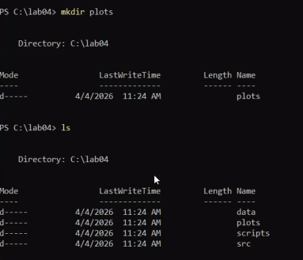{#fig:001 width=70%}

Откроем консоль julia, чтобы установить необходимые пакеты. (рис. [-@fig:002]).

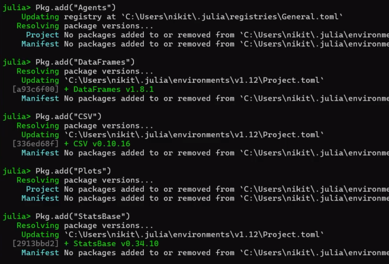{#fig:001 width=70%}


В текстовом редакторе записываю код для создания скрипта sir_model.jl (рис. [-@fig:003]).

``` 
# C:\lab04\scripts\run_basic.jl
# Базовый запуск модели SIR

# Подключаем файл с моделью
include(joinpath(@__DIR__, "..", "src", "sir_model.jl"))
using DataFrames, Plots, JLD2

# Параметры эксперимента
params = Dict(
    :Ns => [1000, 1000, 1000],
    :β_und => [0.5, 0.5, 0.5],
    :β_det => [0.05, 0.05, 0.05],
    :infection_period => 14,
    :detection_time => 7,
    :death_rate => 0.02,
    :reinfection_probability => 0.1,
    :Is => [0, 0, 1],
    :seed => 42,
)

println("Инициализация модели...")
model = initialize_sir(; params...)

# Массивы для хранения данных
times = Int[]
S_vals = Int[]
I_vals = Int[]
R_vals = Int[]
total_vals = Int[]

n_steps = 100
println("Запуск симуляции на $n_steps дней...")

for step in 1:n_steps
    # Обновляем всех агентов
    for agent in allagents(model)
        sir_agent_step!(agent, model)
    end
    
    push!(times, step)
    push!(S_vals, susceptible_count(model))
    push!(I_vals, infected_count(model))
    push!(R_vals, recovered_count(model))
    push!(total_vals, total_count(model))
    
    if step % 20 == 0
        println("  День $step: S=$(S_vals[end]), I=$(I_vals[end]), R=$(R_vals[end])")
    end
end

# Создаём DataFrame
agent_df = DataFrame(time=times, susceptible=S_vals, infected=I_vals, recovered=R_vals)
model_df = DataFrame(time=times, total=total_vals)

# Сохраняем данные
@save joinpath(@__DIR__, "..", "data", "basic_agent.jld2") agent_df
@save joinpath(@__DIR__, "..", "data", "basic_model.jld2") model_df
println("Данные сохранены в data/")

# Визуализация
p = plot(agent_df.time, agent_df.susceptible, 
         label="Восприимчивые (S)", 
         xlabel="Дни", 
         ylabel="Количество", 
         linewidth=2)
         
plot!(p, agent_df.time, agent_df.infected, 
      label="Инфицированные (I)", 
      linewidth=2)
      
plot!(p, agent_df.time, agent_df.recovered, 
      label="Выздоровевшие (R)", 
      linewidth=2)
      
plot!(p, agent_df.time, model_df.total, 
      label="Всего (включая умерших)", 
      linewidth=2, 
      linestyle=:dash)

title!(p, "Модель SIR: Динамика эпидемии")

# Сохраняем график
savefig(joinpath(@__DIR__, "..", "plots", "sir_basic_dynamics.png"))
println("График сохранён в plots/sir_basic_dynamics.png")

# Показываем график
display(p)
```


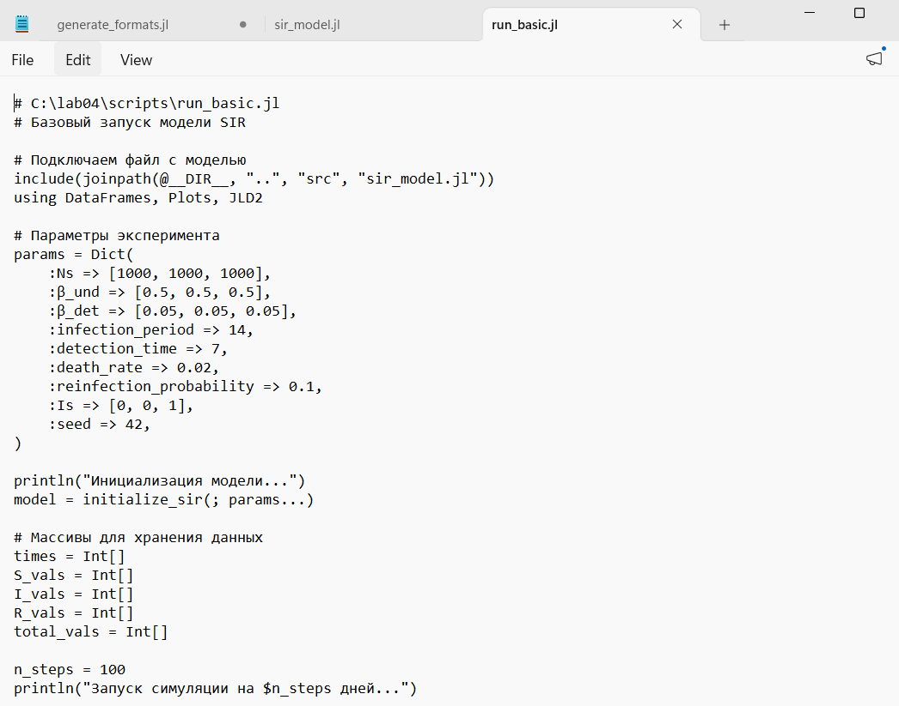{#fig:001 width=70%}

После его запуска появилась диаграмма в папке plots (рис. [-@fig:004]).

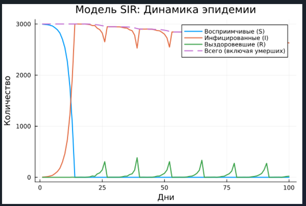{#fig:001 width=70%}

Далее создаем новый скрипт scan_beta.jl, следующего содержания(рис. [-@fig:005]).

```
# C:\lab04\scripts\scan_beta.jl
# Параметрическое сканирование коэффициента заразности β

include(joinpath(@__DIR__, "..", "src", "sir_model.jl"))
using DataFrames, CSV, Plots, Statistics

# Функция для запуска одного эксперимента
function run_experiment(beta, seed, n_steps=100)
    β_und = fill(beta, 3)
    β_det = fill(beta/10, 3)
    
    model = initialize_sir(;
        Ns = [1000, 1000, 1000],
        β_und = β_und,
        β_det = β_det,
        infection_period = 14,
        detection_time = 7,
        death_rate = 0.02,
        reinfection_probability = 0.1,
        Is = [0, 0, 1],
        seed = seed,
    )
    
    # Отслеживаем пик заболеваемости
    peak_infected = 0.0
    
    for step in 1:n_steps
        for agent in allagents(model)
            sir_agent_step!(agent, model)
        end
        frac = infected_count(model) / nagents(model)
        if frac > peak_infected
            peak_infected = frac
        end
    end
    
    final_infected = infected_count(model) / nagents(model)
    final_recovered = recovered_count(model) / nagents(model)
    total_deaths = sum(model.Ns) - nagents(model)
    
    return (peak=peak_infected, final_inf=final_infected, 
            final_rec=final_recovered, deaths=total_deaths)
end

# Диапазон значений β
beta_range = 0.1:0.1:1.0
seeds = [42, 43, 44]

println("Запуск параметрического сканирования...")
println("β значений: $(collect(beta_range))")
println("Повторов на каждое β: $(length(seeds))")
println()

# Сбор результатов
results = []

for beta in beta_range
    for seed in seeds
        println("β=$beta, seed=$seed")
        data = run_experiment(beta, seed)
        push!(results, (β_und=beta, seed=seed, peak=data.peak, 
                        final_inf=data.final_inf, final_rec=data.final_rec, 
                        deaths=data.deaths))
    end
end

# Сохраняем все прогоны
df = DataFrame(results)
CSV.write(joinpath(@__DIR__, "..", "data", "beta_scan_all.csv"), df)
println("\nРезультаты сохранены в data/beta_scan_all.csv")

# Усреднение по повторам
grouped = combine(groupby(df, :β_und), 
    :peak => mean => :mean_peak,
    :final_inf => mean => :mean_final_inf,
    :deaths => mean => :mean_deaths)

# График
p = plot(grouped.β_und, grouped.mean_peak, 
         label="Пик эпидемии", 
         marker=:circle, 
         linewidth=2,
         xlabel="Коэффициент заразности β", 
         ylabel="Доля инфицированных")
         
plot!(p, grouped.β_und, grouped.mean_final_inf, 
      label="Конечная доля инфицированных", 
      marker=:square, 
      linewidth=2)
      
plot!(p, grouped.β_und, grouped.mean_deaths ./ 3000, 
      label="Доля умерших", 
      marker=:diamond, 
      linewidth=2)

title!(p, "Зависимость показателей эпидемии от β")

savefig(joinpath(@__DIR__, "..", "plots", "beta_scan.png"))
println("График сохранён в plots/beta_scan.png")
display(p)

println("\nГотово!")
```
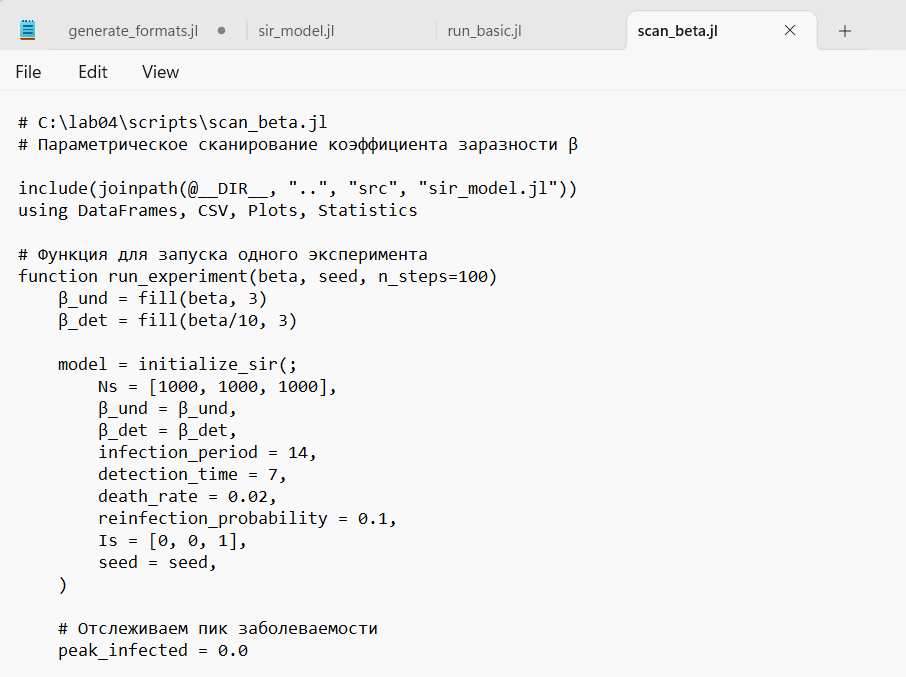{#fig:001 width=70%}

После запуска скрипта мы создали новую диаграмму.  (рис. [-@fig:006]).

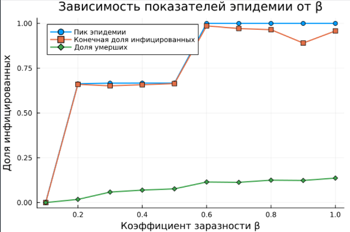{#fig:001 width=70%}

После этого мы прописали скрипт sir_visualize_dynamics.jl, чтобы увидеть динамику каждого аспекта по отдельности: (рис. [-@fig:007]).

```
# C:\lab04\scripts\sir_visualize_dynamics.jl
# Сводная визуализация результатов параметрического сканирования

include(joinpath(@__DIR__, "..", "src", "sir_model.jl"))
using DataFrames, CSV, Plots, Statistics

println("="^60)
println("СВОДНАЯ ВИЗУАЛИЗАЦИЯ РЕЗУЛЬТАТОВ")
println("="^60)

# -------------------------------------------------------------------
# 1. Загрузка результатов сканирования β
# -------------------------------------------------------------------
csv_path = joinpath(@__DIR__, "..", "data", "beta_scan_all.csv")

if !isfile(csv_path)
    println("Файл beta_scan_all.csv не найден!")
    println("Запускаем сканирование β...")
    include(joinpath(@__DIR__, "scan_beta.jl"))
end

# Загружаем данные
df = CSV.read(csv_path, DataFrame)
println("Загружено $(nrow(df)) записей")

# Усреднение по повторам (группируем по β_und)
grouped = combine(groupby(df, :β_und),
    :peak => mean => :mean_peak,
    :final_inf => mean => :mean_final_inf,
    :final_rec => mean => :mean_final_rec,
    :deaths => mean => :mean_deaths)

# -------------------------------------------------------------------
# 2. Создание комплексного графика (3 панели)
# -------------------------------------------------------------------

# Панель 1: Пик эпидемии и конечная доля инфицированных
p1 = plot(grouped.β_und, grouped.mean_peak .* 100,
     label="Пик эпидемии", 
     marker=:circle, linewidth=2, color=:red,
     xlabel="Коэффициент заразности β",
     ylabel="Доля инфицированных (%)",
     title="Динамика эпидемии",
     legend=:topleft)
plot!(p1, grouped.β_und, grouped.mean_final_inf .* 100,
      label="Конечная доля инфицированных",
      marker=:square, linewidth=2, color=:blue)

# Панель 2: Доля умерших
p2 = plot(grouped.β_und, grouped.mean_deaths ./ 3000 .* 100,
     label="Доля умерших",
     marker=:diamond, linewidth=2, color=:black,
     xlabel="Коэффициент заразности β",
     ylabel="Доля умерших (%)",
     title="Смертность",
     legend=:topleft)

# Панель 3: Доля выздоровевших
p3 = plot(grouped.β_und, grouped.mean_final_rec .* 100,
     label="Доля выздоровевших",
     marker=:hexagon, linewidth=2, color=:green,
     xlabel="Коэффициент заразности β",
     ylabel="Доля выздоровевших (%)",
     title="Иммунитет",
     legend=:topleft)

# -------------------------------------------------------------------
# 3. Объединение в один график
# -------------------------------------------------------------------
final_plot = plot(p1, p2, p3, layout=(3,1), size=(800, 900),
                  title="Комплексный анализ эпидемиологической модели SIR")

# Сохраняем
output_path = joinpath(@__DIR__, "..", "plots", "comprehensive_analysis.png")
savefig(final_plot, output_path)
println("График сохранён: plots/comprehensive_analysis.png")

# -------------------------------------------------------------------
# 4. Дополнительный график: R0 и порог коллективного иммунитета
# -------------------------------------------------------------------
println("\n🔹 Дополнительный анализ")

# Расчёт R0 для каждого β
γ = 1/14
grouped.R0 = grouped.β_und / γ
grouped.herd_immunity = (1 .- 1 ./ grouped.R0) .* 100

p4 = plot(grouped.β_und, grouped.R0,
     label="R₀ = β/γ",
     marker=:circle, linewidth=2, color=:purple,
     xlabel="Коэффициент заразности β",
     ylabel="R₀",
     title="Базовое репродуктивное число",
     legend=:topleft)
hline!(p4, [1], label="Порог R₀=1", linestyle=:dash, color=:red)

output_path2 = joinpath(@__DIR__, "..", "plots", "R0_analysis.png")
savefig(p4, output_path2)
println("График сохранён: plots/R0_analysis.png")

# -------------------------------------------------------------------
# 5. Дополнительный график: Порог коллективного иммунитета
# -------------------------------------------------------------------
p5 = plot(grouped.β_und, grouped.herd_immunity,
     label="Порог коллективного иммунитета",
     marker=:star, linewidth=2, color=:magenta,
     xlabel="Коэффициент заразности β",
     ylabel="Доля иммунных (%)",
     title="Порог коллективного иммунитета: 1 - 1/R₀",
     legend=:topleft)

output_path3 = joinpath(@__DIR__, "..", "plots", "herd_immunity.png")
savefig(p5, output_path3)
println("График сохранён: plots/herd_immunity.png")

# -------------------------------------------------------------------
# 6. Вывод статистики в консоль
# -------------------------------------------------------------------
println("\n" * "="^60)
println("СТАТИСТИКА ПО РЕЗУЛЬТАТАМ")
println("="^60)

for row in eachrow(grouped)
    println("β = $(row.β_und):")
    println("   Пик I: $(round(row.mean_peak*100, digits=1))%")
    println("   Конечная доля I: $(round(row.mean_final_inf*100, digits=1))%")
    println("   Выздоровело: $(round(row.mean_final_rec*100, digits=1))%")
    println("   Умерло: $(round(row.mean_deaths/3000*100, digits=2))%")
    println("   R₀ = $(round(row.R0, digits=2))")
    println()
end

println("✅ Сводная визуализация завершена!")
println("="^60)

# -------------------------------------------------------------------
# 7. Показать графики (опционально)
# -------------------------------------------------------------------
display(final_plot)
```
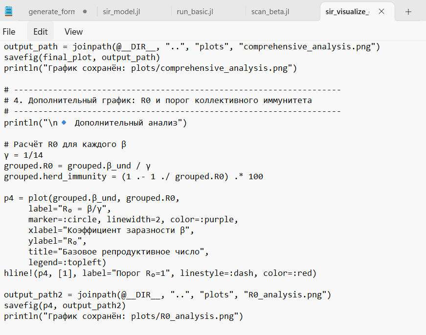{#fig:001 width=70%}

И после запуска скрипта получаем следующие графики:

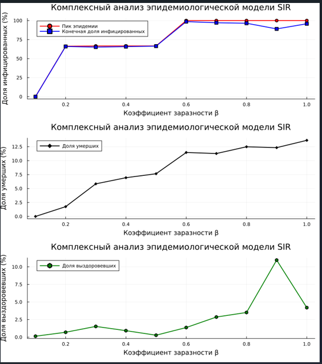{#fig:001 width=70%}

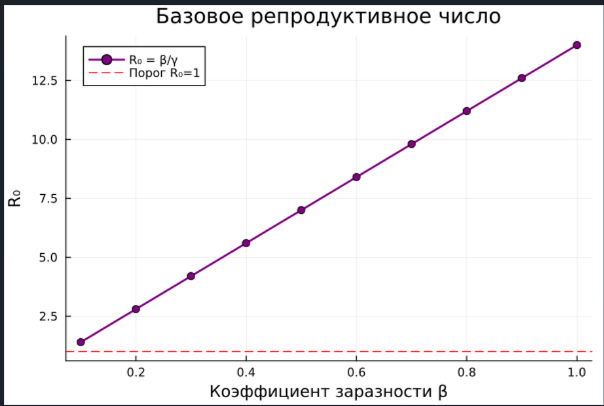{#fig:001 width=70%}

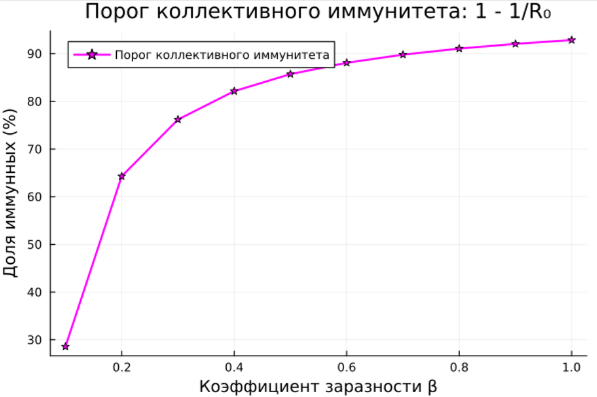{#fig:001 width=70%}

Анализируем все графики.

В конце создали скрипт sir_literate.jl, чтобы сгенерировать из литературного кода с параметрами: (рис. [-@fig:011]).
— чистый код;
— jupyter notebook;
— документацию в формате Quarto.

```
# # Агентная модель SIR
# 
# ## Автор
# Лабораторная работа №4 по имитационному моделированию
# 
# ## Аннотация
# 
# В данной работе реализована агентная модель распространения
# инфекционного заболевания SIR (Susceptible-Infectious-Recovered)
# с использованием пакета `Agents.jl` в Julia.
# 
# Модель учитывает:
# - Три города с возможностью миграции
# - Разную заразность на разных стадиях болезни
# - Смертность и выздоровление
# - Стохастический характер заражения
# 
# ## Теоретическое введение
# 
# ### Классическая модель SIR
# 
# Система дифференциальных уравнений:
# 
# $$ \frac{dS}{dt} = -\beta \frac{SI}{N} $$
# 
# $$ \frac{dI}{dt} = \beta \frac{SI}{N} - \gamma I $$
# 
# $$ \frac{dR}{dt} = \gamma I $$
# 
# где:
# - $\beta$ — коэффициент заражения
# - $\gamma = 1/T$ — скорость выздоровления ($T$ — длительность болезни)
# - $R_0 = \beta / \gamma$ — базовое репродуктивное число
# 
# ### Агентная реализация
# 
# В отличие от аналитической модели, агентный подход позволяет:
# - Учитывать индивидуальные особенности
# - Моделировать пространственную структуру
# - Вводить стохастичность
# 
# ## Исходный код модели

using Agents, Random, DataFrames, Plots, Statistics

# Подключаем основную модель
include(joinpath(@__DIR__, "..", "src", "sir_model.jl"))

# ## Параметры эксперимента

params = Dict(
    :Ns => [1000, 1000, 1000],
    :β_und => [0.5, 0.5, 0.5],
    :β_det => [0.05, 0.05, 0.05],
    :infection_period => 14,
    :detection_time => 7,
    :death_rate => 0.02,
    :Is => [0, 0, 1],
    :seed => 42,
)

println("Параметры модели:")
for (k, v) in params
    println("  $k = $v")
end

# ## Запуск симуляции

model = initialize_sir(; params...)

times = Int[]
S_vals = Int[]
I_vals = Int[]
R_vals = Int[]

for step in 1:100
    Agents.step!(model)
    push!(times, step)
    push!(S_vals, susceptible_count(model))
    push!(I_vals, infected_count(model))
    push!(R_vals, recovered_count(model))
end

# ## Расчёт ключевых показателей

β = 0.5
γ = 1 / 14
R0 = β / γ
peak_I = maximum(I_vals)
peak_day = times[argmax(I_vals)]
final_R = R_vals[end]

println("\n📊 Результаты моделирования:")
println("   R₀ = β/γ = $β / $(round(γ, digits=4)) = $(round(R0, digits=2))")
println("   Пик заболеваемости: $peak_I человек на $peak_day день")
println("   Всего переболело: $final_R человек")
println("   Доля переболевших: $(round(final_R/3000*100, digits=1))%")

# ## Визуализация

p1 = plot(times, S_vals, label="S (Восприимчивые)", lw=2, color=:blue)
plot!(p1, times, I_vals, label="I (Инфицированные)", lw=2, color=:red)
plot!(p1, times, R_vals, label="R (Выздоровевшие)", lw=2, color=:green)
title!(p1, "Динамика SIR модели\nR₀ = $(round(R0, digits=2))")
xlabel!(p1, "Дни")
ylabel!(p1, "Количество людей")
legend!(p1, :topright)

# Сохраняем
savefig(p1, joinpath(@__DIR__, "..", "plots", "literate_sir.png"))
println("\n✅ График сохранён: plots/literate_sir.png")

# ## Вывод

println("\n" * "="^50)
println("Моделирование завершено успешно!")
println("="^50)
```

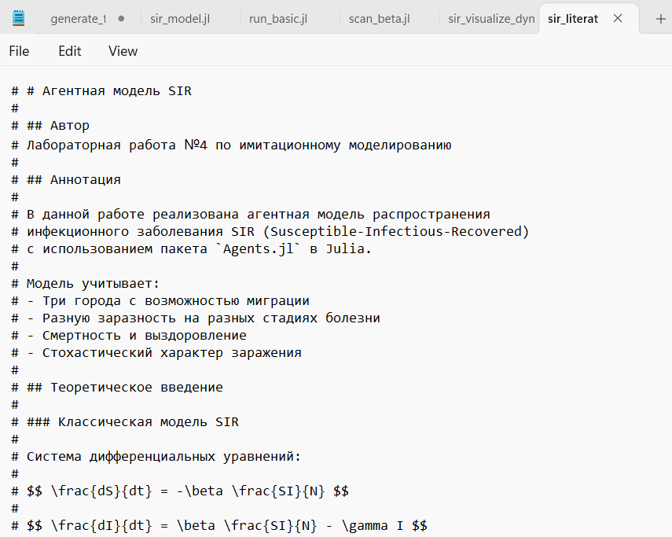{#fig:001 width=70%}


# Выводы
В ходе выполнения лабораторной работы я создал агентную модель распространения инфекционного заболевания на
основе классической компартментальной модели SIR (Susceptible-InfectiousRecovered). Модель будет реализована с использованием пакета Agents.jl. В отличие от классической модели на дифференциальных уравнениях, агентный
подход позволит учесть индивидуальные характеристики, пространственную
структуру и стохастичность процессов.


